<picture><source media="(prefers-color-scheme: dark)" srcset="./assets/capa-dark.svg"></picture>

<picture><source media="(prefers-color-scheme: dark)" srcset="https://readme-typing-svg.demolab.com?font=JetBrains+Mono&size=20&duration=2600&pause=1100&color=58A6FF&center=true&vCenter=true&width=820&height=44&lines=Arquiteto+de+software+e+solu%C3%A7%C3%B5es;Java+%C2%B7+Spring+%C2%B7+AWS+%C2%B7+Claude+Code;Programando+em+Java+desde+2011"></picture>

<a href="https://www.linkedin.com/in/cesar-schutz-10341a21/"><picture><source media="(prefers-color-scheme: dark)" srcset="./assets/pill-linkedin-dark.svg"></picture></a>
<a href="https://blog.cesarschutz.com.br"><picture><source media="(prefers-color-scheme: dark)" srcset="./assets/pill-blog-dark.svg"></picture></a>
<a href="https://github.com/cesarschutz/claude-code-kit"><picture><source media="(prefers-color-scheme: dark)" srcset="./assets/pill-kit-dark.svg"></picture></a>

 

<picture><source media="(prefers-color-scheme: dark)" srcset="./assets/terminal-dark.svg"></picture>

### `~/projetos`

<a href="https://github.com/cesarschutz/claude-code-kit"><picture><source media="(prefers-color-scheme: dark)" srcset="./assets/projeto-claude-code-kit-dark.svg"></picture></a>
<a href="https://github.com/cesarschutz/CSRFinance"><picture><source media="(prefers-color-scheme: dark)" srcset="./assets/projeto-csrfinance-dark.svg"></picture></a>
<a href="https://github.com/cesarschutz/blog"><picture><source media="(prefers-color-scheme: dark)" srcset="./assets/projeto-blog-dark.svg"></picture></a>
<a href="https://github.com/cesarschutz/blog-exemplos"><picture><source media="(prefers-color-scheme: dark)" srcset="./assets/projeto-blog-exemplos-dark.svg"></picture></a>
<a href="https://github.com/cesarschutz/BrainAPI"><picture><source media="(prefers-color-scheme: dark)" srcset="./assets/projeto-brainapi-dark.svg"></picture></a>
<a href="https://github.com/cesarschutz/langchain"><picture><source media="(prefers-color-scheme: dark)" srcset="./assets/projeto-langchain-dark.svg"></picture></a>
<a href="https://github.com/cesarschutz/google-adk-cards"><picture><source media="(prefers-color-scheme: dark)" srcset="./assets/projeto-google-adk-cards-dark.svg"></picture></a>
<a href="https://github.com/cesarschutz/knowledge-base"><picture><source media="(prefers-color-scheme: dark)" srcset="./assets/projeto-knowledge-base-dark.svg"></picture></a>

### `~/github`

  <picture><source media="(prefers-color-scheme: dark)" srcset="https://github-readme-stats.vercel.app/api?username=cesarschutz&show_icons=true&hide_rank=true&hide=stars,issues&include_all_commits=true&locale=pt-br&theme=github_dark&bg_color=161b22&border_color=30363d"></picture>
  <picture><source media="(prefers-color-scheme: dark)" srcset="https://github-readme-stats.vercel.app/api/top-langs/?username=cesarschutz&layout=compact&langs_count=8&locale=pt-br&theme=github_dark&bg_color=161b22&border_color=30363d"></picture>

### `$ git log --graph`

  <picture><source media="(prefers-color-scheme: dark)" srcset="https://streak-stats.demolab.com?user=cesarschutz&locale=pt_BR&hide_border=true&theme=dark&background=161B22&ring=B1B9F9&fire=D77757&currStreakLabel=B1B9F9"></picture>

<picture><source media="(prefers-color-scheme: dark)" srcset="./assets/snake-dark.svg"></picture>
