# Cesar Schutz · capas do perfil

Seis capas para escolher. Todas acompanham o tema do GitHub: clara no modo claro, escura no modo escuro.

## Segunda leva: sobre mim

Feitas a partir da minha trajetória, do trabalho e da stack que uso de verdade.

### 04 · Trajetória

A linha do tempo de 2013 até hoje, de dev back-end da plataforma de cartões a arquiteto, com os números
de cada fase. Embaixo, a stack em ícones por área e o gráfico 3D de contribuições.

<a href="./capas/04-trajetoria/">
<picture>
  <source media="(prefers-color-scheme: dark)" srcset="./capas/04-trajetoria/assets/capa-dark.svg">
  <source media="(prefers-color-scheme: light)" srcset="./capas/04-trajetoria/assets/capa-light.svg">
  
</picture>
</a>

**[Ver a capa completa →](./capas/04-trajetoria/)**

### 05 · Painel

Um painel em blocos: identidade e linha do tempo, números de código e de arquitetura, como eu desenho,
stack e IA. Embaixo, os projetos em cards.

<a href="./capas/05-painel/">
<picture>
  <source media="(prefers-color-scheme: dark)" srcset="./capas/05-painel/assets/capa-dark.svg">
  <source media="(prefers-color-scheme: light)" srcset="./capas/05-painel/assets/capa-light.svg">
  
</picture>
</a>

**[Ver a capa completa →](./capas/05-painel/)**

### 06 · Neofetch

A evolução da capa 03: um terminal que roda `neofetch` com meu perfil e `ls ~/stack` com os ícones.
Embaixo, a stack por área, os projetos, a sequência de contribuições e a cobrinha.

<a href="./capas/06-neofetch/">
<picture>
  <source media="(prefers-color-scheme: dark)" srcset="./capas/06-neofetch/assets/capa-dark.svg">
  <source media="(prefers-color-scheme: light)" srcset="./capas/06-neofetch/assets/capa-light.svg">
  
</picture>
</a>

**[Ver a capa completa →](./capas/06-neofetch/)**

## Primeira leva

### 01 · Rastro

O trace de uma cobrança atravessando gateway, API, ledger, outbox e fila, desenhado span a span.
A capa para quem chega pelo lado de arquitetura e sistemas distribuídos.

<a href="./capas/01-rastro/">
<picture>
  <source media="(prefers-color-scheme: dark)" srcset="./capas/01-rastro/assets/capa-dark.svg">
  <source media="(prefers-color-scheme: light)" srcset="./capas/01-rastro/assets/capa-light.svg">
  
</picture>
</a>

**[Ver a capa completa →](./capas/01-rastro/)**

### 02 · Caderno

Uma página de caderno com o nome escrito à caneta, a frase do blog no marca-texto e uma ficha de estudos.
A lista de artigos se atualiza sozinha a partir do RSS. A capa para quem chega pelo blog.

<a href="./capas/02-caderno/">
<picture>
  <source media="(prefers-color-scheme: dark)" srcset="./capas/02-caderno/assets/capa-dark.svg">
  <source media="(prefers-color-scheme: light)" srcset="./capas/02-caderno/assets/capa-light.svg">
  
</picture>
</a>

**[Ver a capa completa →](./capas/02-caderno/)**

### 03 · Terminal

Um terminal que digita `whoami`, mostra o foco e instala o `csr-cockpit`, com as cores do claude-code-kit.
A capa para quem chega pelas ferramentas de IA.

<a href="./capas/03-terminal/">
<picture>
  <source media="(prefers-color-scheme: dark)" srcset="./capas/03-terminal/assets/capa-dark.svg">
  <source media="(prefers-color-scheme: light)" srcset="./capas/03-terminal/assets/capa-light.svg">
  
</picture>
</a>

**[Ver a capa completa →](./capas/03-terminal/)**

---

[RECURSOS.md](./RECURSOS.md) lista todos os recursos que existiam nos 10 modelos anteriores, onde cada um
foi usado em cada capa e quais ficaram de fora (e por quê).

### Como adotar uma capa

1. Copie `capas/<capa>/README.md` para a raiz, por cima deste arquivo.
2. Troque `./assets/` por `./capas/<capa>/assets/` nos caminhos das imagens.
3. Na capa 02, troque `readme_path` em `.github/workflows/capa-02-artigos.yml` para `./README.md`.
   Na capa 04, troque `../../profile-3d-contrib/` por `./profile-3d-contrib/`.
4. Apague as pastas e os workflows das capas que não foram escolhidas.
