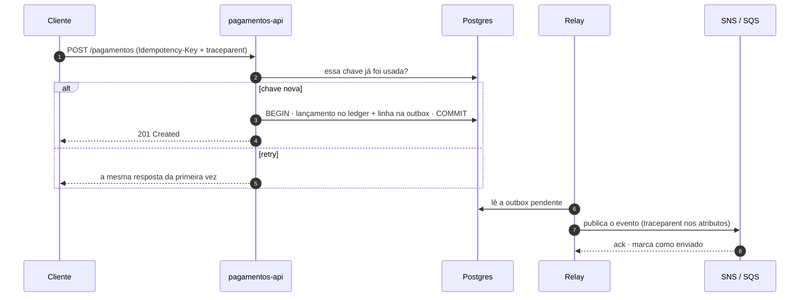

<picture>
  <source media="(prefers-color-scheme: dark)" srcset="./assets/capa-dark.svg">
  <source media="(prefers-color-scheme: light)" srcset="./assets/capa-light.svg">
  
</picture>

## Sobre

Sou arquiteto de soluções. Passo o dia entre fronteiras de serviço, filas e bancos de dados,
e boa parte do resto transformando o que estudo em artigo no [blog](https://blog.cesarschutz.com.br).

Gosto de sistema que dá para explicar: decisão escrita, efeito registrado e requisição
rastreável do começo ao fim, que é exatamente o que a capa aí em cima desenha.

## O caminho de uma requisição

Uma cobrança que não pode sair em dobro nem se perder no meio do caminho. Cada passo deste diagrama
tem um artigo por trás.

| Passo | Leitura |
|---|---|
| 1–2 · chave de idempotência | [Como impedir a cobrança duplicada no retry](https://blog.cesarschutz.com.br/posts/cobranca-duplicada-no-retry/) |
| 3 · ledger | [Arquitetura de ledger — partidas dobradas, saldos e conciliação](https://blog.cesarschutz.com.br/posts/arquitetura-de-ledger/) |
| 3 · outbox | [Efeito externo sem registro local](https://blog.cesarschutz.com.br/posts/efeito-externo-sem-registro-local/) |
| 7–8 · fila | [SNS MessageAttributes e Filter Policy](https://blog.cesarschutz.com.br/posts/sns-filter-policy/) |
| tudo · rastreio | [W3C Trace Context e o traceparent](https://blog.cesarschutz.com.br/posts/w3c-trace-context/) |

## Onde eu passo o tempo

<table>
<tr>
<td width="33%" valign="top">

**Arquitetura**

DDD e fronteiras 
ledger e conciliação 
idempotência e outbox 
[trade-offs explícitos](https://blog.cesarschutz.com.br/posts/overhead-vs-overkill/)

</td>
<td width="33%" valign="top">

**Runtime**

Java 21+ e Spring Boot 
AWS: SNS, SQS, RDS 
Kubernetes: CronJob, SIGTERM 
logs estruturados e tracing

</td>
<td width="33%" valign="top">

**IA aplicada**

Claude Code: mods, skills, agentes 
MCP e Google ADK 
agentes sobre specs OpenAPI 
LangChain

</td>
</tr>
</table>

## Projetos

| Projeto | O que é |
|---|---|
| [claude-code-kit](https://github.com/cesarschutz/claude-code-kit) | Marketplace de plugins para o Claude Code: mods, skills, agentes, hooks e temas. |
| [blog](https://github.com/cesarschutz/blog) | O código do [blog.cesarschutz.com.br](https://blog.cesarschutz.com.br), em Astro. |
| [dev-note](https://github.com/cesarschutz/dev-note) | Notícias técnicas que viram aprendizado. |
| [BrainAPI](https://github.com/cesarschutz/BrainAPI) | Transforma specs OpenAPI em endpoints usáveis em linguagem natural. |
| [swagger-agent-adk](https://github.com/cesarschutz/swagger-agent-adk) | Agentes para APIs Swagger com Google ADK. |
| [jaeger-rastreando-dois-projetos-spring-boot](https://github.com/cesarschutz/jaeger-rastreando-dois-projetos-spring-boot) | Tracing distribuído entre dois serviços Spring Boot. |

## Stack

  <picture>
    <source media="(prefers-color-scheme: dark)" srcset="https://skillicons.dev/icons?i=java,spring,postgres,mongodb,kafka,aws,kubernetes,docker,gradle,ts,astro,python&theme=dark">
    <source media="(prefers-color-scheme: light)" srcset="https://skillicons.dev/icons?i=java,spring,postgres,mongodb,kafka,aws,kubernetes,docker,gradle,ts,astro,python&theme=light">
    
  </picture>

## Telemetria

  <picture>
    <source media="(prefers-color-scheme: dark)" srcset="https://github-readme-stats.vercel.app/api?username=cesarschutz&show_icons=true&hide_border=true&hide_rank=true&hide=stars,issues&include_all_commits=true&locale=pt-br&theme=github_dark&bg_color=0d1117">
    <source media="(prefers-color-scheme: light)" srcset="https://github-readme-stats.vercel.app/api?username=cesarschutz&show_icons=true&hide_border=true&hide_rank=true&hide=stars,issues&include_all_commits=true&locale=pt-br&theme=default">
    
  </picture>
  <picture>
    <source media="(prefers-color-scheme: dark)" srcset="https://github-readme-stats.vercel.app/api/top-langs/?username=cesarschutz&layout=compact&hide_border=true&langs_count=8&locale=pt-br&theme=github_dark&bg_color=0d1117">
    <source media="(prefers-color-scheme: light)" srcset="https://github-readme-stats.vercel.app/api/top-langs/?username=cesarschutz&layout=compact&hide_border=true&langs_count=8&locale=pt-br&theme=default">
    
  </picture>

> Se não tem `traceparent`, não aconteceu.
