<picture>
  <source media="(prefers-color-scheme: dark)" srcset="./assets/capa-dark.svg">
  <source media="(prefers-color-scheme: light)" srcset="./assets/capa-light.svg">
  
</picture>

 

## Sobre este caderno

Sou o Cesar, arquiteto de soluções. Este perfil funciona como o meu caderno: o que eu estudo vira
repositório, o repositório vira teste e o teste vira artigo. Escrevo sobre arquitetura, Java,
pagamentos, AWS, Kubernetes e IA aplicada, sempre com código que roda e SQL testado.

## Últimas páginas

<!-- BLOG-POST-LIST:START -->
- `03/10/2026` · [Parquet e snapshots — o arquivo não garante a fotografia](https://blog.cesarschutz.com.br/posts/parquet-snapshot-banco-de-dados/)
- `02/10/2026` · [Um mod do Claude Code na prática — instalação, testes e limites &lpar;parte 2 de 2&rpar;](https://blog.cesarschutz.com.br/posts/claude-code-csr-cockpit/)
- `02/10/2026` · [Mods do Claude Code — o que são e as peças que vieram antes &lpar;parte 1 de 2&rpar;](https://blog.cesarschutz.com.br/posts/claude-code-do-claude-md-ao-mod/)
- `29/09/2026` · [Criptografia em repouso e em trânsito — o que é e como ativar no Postgres e no MongoDB](https://blog.cesarschutz.com.br/posts/criptografia-em-repouso-e-em-transito/)
- `25/09/2026` · [Filtros de serialização no Jackson — mascarando número de cartão nos logs](https://blog.cesarschutz.com.br/posts/jackson-filtros-mascarando-cartao/)
- `23/09/2026` · [CronJob ou endpoint + fila — onde rodar o batch de uma API Spring Boot no Kubernetes](https://blog.cesarschutz.com.br/posts/cronjob-vs-endpoint-sqs/)

<!-- BLOG-POST-LIST:END -->

Esta lista se atualiza sozinha todo dia, a partir do RSS do blog.

## Decisões que eu repito

No caderno, toda decisão ganha número. Estas aparecem em quase todo projeto:

<b>D01 · Grave a intenção antes de causar o efeito</b>

 

**Contexto:** a cobrança passou no adquirente e o banco não gravou. 
**Decisão:** transação local com outbox; o efeito externo sai depois, pelo relay. 
**Consequência:** consistência eventual explícita e conciliação como entregável. 
→ [Efeito externo sem registro local](https://blog.cesarschutz.com.br/posts/efeito-externo-sem-registro-local/)

<b>D02 · Retry sem chave de idempotência é cobrança em dobro</b>

 

**Contexto:** consultar antes de gravar não segura dois retries concorrentes. 
**Decisão:** chave de idempotência, restrição única no banco e resposta guardada. 
**Consequência:** o retry passa a ser seguro, e não só provável de dar certo. 
→ [Chave de idempotência](https://blog.cesarschutz.com.br/posts/cobranca-duplicada-no-retry/)

<b>D03 · Se não tem traceparent, não aconteceu</b>

 

**Contexto:** um erro atravessa cinco serviços e cada log conta só um pedaço. 
**Decisão:** W3C Trace Context em toda chamada, inclusive passando pela outbox. 
**Consequência:** uma busca pelo trace-id conta a história inteira. 
→ [W3C Trace Context](https://blog.cesarschutz.com.br/posts/w3c-trace-context/)

<b>D04 · Toda escolha tem overhead; o problema é o overkill</b>

 

**Contexto:** padrão bom aplicado no lugar errado vira custo sem retorno. 
**Decisão:** escrever o custo de cada escolha antes de adotá-la. 
**Consequência:** menos arquitetura de vitrine, mais arquitetura que se paga. 
→ [Overhead vs overkill](https://blog.cesarschutz.com.br/posts/overhead-vs-overkill/)

<b>D05 · IA é mais um componente: tem contrato, custo e telemetria</b>

 

**Contexto:** agentes rodando sem ninguém saber quanto custaram nem o que fizeram. 
**Decisão:** tratar o agente como qualquer dependência: medir, limitar e registrar. 
**Consequência:** foi daí que nasceu o painel de custo por agente do claude-code-kit. 
→ [Do CLAUDE.md ao mod no Claude Code](https://blog.cesarschutz.com.br/posts/claude-code-do-claude-md-ao-mod/)

## Índice do caderno

| Capítulo | Páginas |
|---|---|
| Pagamentos e consistência | [ledger](https://blog.cesarschutz.com.br/posts/arquitetura-de-ledger/) · [idempotência](https://blog.cesarschutz.com.br/posts/cobranca-duplicada-no-retry/) · [outbox](https://blog.cesarschutz.com.br/posts/efeito-externo-sem-registro-local/) · [bloqueio otimista e pessimista](https://blog.cesarschutz.com.br/posts/bloqueio-otimista-e-pessimista/) |
| Java e Spring | [Java 21](https://blog.cesarschutz.com.br/posts/java-21/) · [Java 25](https://blog.cesarschutz.com.br/posts/java-25/) · [virtual threads](https://blog.cesarschutz.com.br/posts/virtual-threads-pinning-close-wait/) · [AOP](https://blog.cesarschutz.com.br/posts/aop-jdk-proxy-cglib/) · [Jackson](https://blog.cesarschutz.com.br/posts/jackson-filtros-mascarando-cartao/) |
| Nuvem e runtime | [SNS e SQS](https://blog.cesarschutz.com.br/posts/sns-filter-policy/) · [CronJob](https://blog.cesarschutz.com.br/posts/kubernetes-cronjob-concorrencia/) · [SIGTERM e SIGKILL](https://blog.cesarschutz.com.br/posts/sigterm-sigkill-kubernetes/) · [criptografia](https://blog.cesarschutz.com.br/posts/criptografia-em-repouso-e-em-transito/) |
| Observabilidade | [traceparent](https://blog.cesarschutz.com.br/posts/w3c-trace-context/) · [logging estruturado](https://blog.cesarschutz.com.br/posts/logging-estruturado-spring-boot/) · [wide events](https://blog.cesarschutz.com.br/posts/wide-events-canonical-log-lines/) |
| IA aplicada | [claude-code-kit](https://github.com/cesarschutz/claude-code-kit) · [swagger-agent-adk](https://github.com/cesarschutz/swagger-agent-adk) · [BrainAPI](https://github.com/cesarschutz/BrainAPI) · [first-mcp-weather](https://github.com/cesarschutz/first-mcp-weather) |

## Os rascunhos

- [**blog**](https://github.com/cesarschutz/blog): o código do blog, em Astro.
- [**blog-exemplos**](https://github.com/cesarschutz/blog-exemplos): o código que acompanha os artigos.
- [**knowledge-base**](https://github.com/cesarschutz/knowledge-base): minha base de conhecimento.
- [**dev-note**](https://github.com/cesarschutz/dev-note): notícias técnicas que viram aprendizado.

Papel de dia, grafite à noite: este perfil acompanha o tema do seu GitHub.

