<div align="center">

<picture>
  <source media="(prefers-color-scheme: dark)" srcset="./assets/capa-dark.svg">
  <source media="(prefers-color-scheme: light)" srcset="./assets/capa-light.svg">
  
</picture>

<picture>
  <source media="(prefers-color-scheme: dark)" srcset="https://readme-typing-svg.demolab.com?font=JetBrains+Mono&size=20&duration=2600&pause=1100&color=B1B9F9&center=true&vCenter=true&width=820&height=44&lines=Arquiteto+de+solu%C3%A7%C3%B5es;Java+%C2%B7+Spring+%C2%B7+AWS+%C2%B7+Kubernetes;Pagamentos:+ledger,+idempot%C3%AAncia,+outbox;IA+aplicada:+agentes,+MCP+e+Claude+Code;O+que+eu+estudo+vira+artigo">
  <source media="(prefers-color-scheme: light)" srcset="https://readme-typing-svg.demolab.com?font=JetBrains+Mono&size=20&duration=2600&pause=1100&color=5A5FC8&center=true&vCenter=true&width=820&height=44&lines=Arquiteto+de+solu%C3%A7%C3%B5es;Java+%C2%B7+Spring+%C2%B7+AWS+%C2%B7+Kubernetes;Pagamentos:+ledger,+idempot%C3%AAncia,+outbox;IA+aplicada:+agentes,+MCP+e+Claude+Code;O+que+eu+estudo+vira+artigo">
  
</picture>

</div>

### `~/sobre`

```console
cesar@arquitetura:~$ cat sobre.md
Arquiteto de soluções. Desenho sistemas distribuídos, com cuidado especial por
pagamentos, consistência e observabilidade, e escrevo sobre o que estudo em
blog.cesarschutz.com.br. Ultimamente, também construo ferramentas para programar com IA.
```

### `~/projetos`

```text
~/projetos
├── claude-code-kit ........ marketplace de plugins para o Claude Code
├── blog ................... blog.cesarschutz.com.br, em Astro
├── blog-exemplos .......... o código que acompanha os artigos
├── dev-note ............... notícias técnicas que viram aprendizado
├── knowledge-base ......... minha base de conhecimento
├── BrainAPI ............... OpenAPI → endpoints em linguagem natural
├── swagger-agent-adk ...... agentes para APIs com Google ADK
├── first-mcp-weather ...... meu primeiro servidor MCP
└── jaeger-* ............... tracing distribuído com Spring Boot
```

### `$ status`

| Projeto | Estado | |
|---|---|---|
| [claude-code-kit](https://github.com/cesarschutz/claude-code-kit) | 🟢 ativo | [](https://github.com/cesarschutz/claude-code-kit/tree/main/plugins/csr-cockpit) [](https://github.com/cesarschutz/claude-code-kit#catálogo) |
| [blog](https://github.com/cesarschutz/blog) | 🟢 publicando | [](https://blog.cesarschutz.com.br/rss.xml) |
| [dev-note](https://github.com/cesarschutz/dev-note) | 🟢 ativo | [](https://dev-note-phi.vercel.app) |
| [BrainAPI](https://github.com/cesarschutz/BrainAPI) | 🔵 experimento | |
| [swagger-agent-adk](https://github.com/cesarschutz/swagger-agent-adk) | 🔵 experimento | |
| [jaeger-rastreando-dois-projetos-spring-boot](https://github.com/cesarschutz/jaeger-rastreando-dois-projetos-spring-boot) | ⚪ arquivo | |

<sub>🟢 em uso · 🔵 experimento · ⚪ referência antiga</sub>

### `$ stack`

`java` `spring boot` `postgres` `mongodb` `aws sns/sqs` `kubernetes` `docker` `gradle` `typescript` `astro` `python` `claude code` `mcp` `google adk`

### `$ git log --graph`

<p align="center">
  <picture>
    <source media="(prefers-color-scheme: dark)" srcset="https://streak-stats.demolab.com?user=cesarschutz&locale=pt_BR&hide_border=true&theme=dark&background=161B22&ring=B1B9F9&fire=D77757&currStreakLabel=B1B9F9">
    <source media="(prefers-color-scheme: light)" srcset="https://streak-stats.demolab.com?user=cesarschutz&locale=pt_BR&hide_border=true&theme=default&ring=5A5FC8&fire=B4542F&currStreakLabel=5A5FC8">
    
  </picture>
</p>

<p align="center">
  <picture>
    <source media="(prefers-color-scheme: dark)" srcset="./assets/snake-dark.svg">
    <source media="(prefers-color-scheme: light)" srcset="./assets/snake-light.svg">
    
  </picture>
</p>

```console
cesar@arquitetura:~$ exit
logout — valeu pela visita. ☕
```
