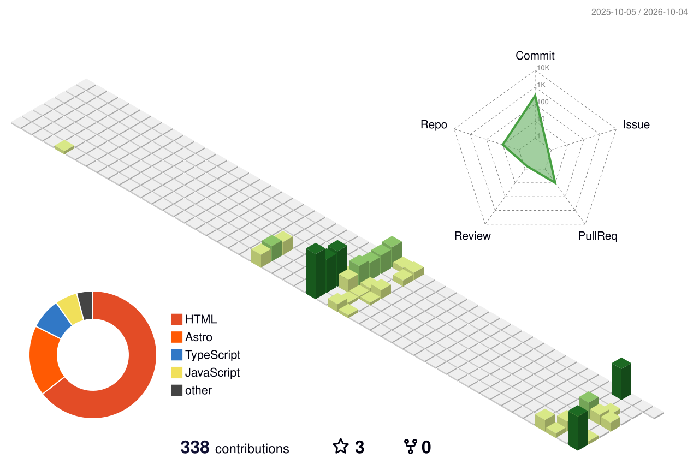

<picture>
  <source media="(prefers-color-scheme: dark)" srcset="./assets/capa-dark.svg">
  <source media="(prefers-color-scheme: light)" srcset="./assets/capa-light.svg">
  
</picture>

 

## Sobre

Sou arquiteto de soluções. Programo em Java desde 2011: comecei em sistemas de imagens médicas,
passei por Java EE e depois por microsserviços com Spring Cloud e Angular.

Em 2019 entrei na plataforma de cartões como dev Java sênior. Em 2020 virei líder técnico e, desde
2021, sou arquiteto de soluções dessa plataforma: contas, faturas, propostas, boletos, open banking e
carteiras digitais. Desde 2025 também cuido da arquitetura do programa de fidelidade.

Meu trabalho hoje é decidir e registrar: ADRs curtas, modelo C4 e padrões que o time reaproveita.

## O que eu faço

<table>
<tr>
<td width="33%" valign="top">

**Decisões**

ADRs com contexto, decisão, alternativas que foram de fato avaliadas e consequências. Curtas, para
serem lidas.

</td>
<td width="33%" valign="top">

**Modelos**

C4 no Structurizr (contexto, containers e fluxos dinâmicos), sequência em PlantUML e Mermaid,
publicados na wiki do time.

</td>
<td width="33%" valign="top">

**Padrões**

Transactional Outbox, Job Pattern no Kubernetes, idempotência e eventos com SNS/SQS, escritos uma vez
e reaproveitados nas ADRs.

</td>
</tr>
</table>

## Stack

<picture>
  <source media="(prefers-color-scheme: dark)" srcset="./assets/stack-dark.svg">
  <source media="(prefers-color-scheme: light)" srcset="./assets/stack-light.svg">
  
</picture>

## Formação

| | Curso | Instituição | Período |
|---|---|---|---|
| MBA | Arquitetura de Software | Full Cycle | 2025 – 2026 (em andamento) |
| MBA | Engenharia de Software com IA | Full Cycle | 2025 – 2026 (em andamento) |
| Pós-graduação | Engenharia de Software | Unisinos | 2021 – 2022 |
| Graduação | Tecnólogo em Análise e Desenvolvimento de Sistemas | Senac RS | 2013 – 2019 |
| Técnico | Informática | Universitário Escola Técnica | 2009 – 2011 |

**Certificação:** Agile Scrum Foundation · EXIN (2018)

## Projetos pessoais

| Projeto | O que é |
|---|---|
| [claude-code-kit](https://github.com/cesarschutz/claude-code-kit) | Marketplace de plugins para o Claude Code: mods, skills, agentes, hooks e temas. |
| [BrainAPI](https://github.com/cesarschutz/BrainAPI) | Transforma specs OpenAPI em endpoints usáveis em linguagem natural, via MCP. |
| [swagger-agent-adk](https://github.com/cesarschutz/swagger-agent-adk) | Agentes para APIs Swagger com Google ADK. |
| [blog](https://github.com/cesarschutz/blog) | O código do meu blog técnico, em Astro. |

## Contribuições

<picture>
  <source media="(prefers-color-scheme: dark)" srcset="../../profile-3d-contrib/profile-night-rainbow.svg">
  <source media="(prefers-color-scheme: light)" srcset="../../profile-3d-contrib/profile-green-animate.svg">
  
</picture>
