<div align="center">

<picture>
  <source media="(prefers-color-scheme: dark)" srcset="./assets/capa-dark.svg">
  <source media="(prefers-color-scheme: light)" srcset="./assets/capa-light.svg">
  
</picture>

<picture>
  <source media="(prefers-color-scheme: dark)" srcset="https://readme-typing-svg.demolab.com?font=JetBrains+Mono&size=20&duration=2600&pause=1100&color=B1B9F9&center=true&vCenter=true&width=820&height=44&lines=Arquiteto+de+software;Cart%C3%B5es+%C2%B7+fidelidade+%C2%B7+pagamentos;Java+%C2%B7+Spring+%C2%B7+AWS+%C2%B7+Kubernetes;ADRs,+C4+e+padr%C3%B5es+que+o+time+reaproveita;Claude+Code+como+segundo+c%C3%A9rebro">
  
</picture>

[](https://www.linkedin.com/in/cesar-schutz-10341a21/)
[](https://blog.cesarschutz.com.br)
[](https://github.com/cesarschutz/claude-code-kit)

</div>

### `~/sobre`

```console
cesar@arquitetura:~$ cat sobre.md
Arquiteto de software. De 2019 a 2024 fui dev back-end da plataforma de cartões:
contas, faturas, propostas, boletos, open banking e carteiras digitais, em Java e Spring na AWS.
Desde 2025 cuido da arquitetura dessa plataforma e do programa de fidelidade.

cesar@arquitetura:~$ cat trabalho.md
- ADRs curtas: contexto, decisão, alternativas avaliadas e consequências
- modelo C4 no Structurizr, fluxos em PlantUML e Mermaid
- padrões reaproveitáveis: Transactional Outbox, Job Pattern, idempotência
- Claude Code como segundo cérebro: comandos e regras próprios para escrever e revisar ADRs
```

### `~/stack`

| | |
|---|---|
| **Linguagens e frameworks** | <picture><source media="(prefers-color-scheme: dark)" srcset="./assets/stack-1-dark.svg"></picture> |
| **Dados e mensageria** | <picture><source media="(prefers-color-scheme: dark)" srcset="./assets/stack-2-dark.svg"></picture> |
| **Cloud e entrega** | <picture><source media="(prefers-color-scheme: dark)" srcset="./assets/stack-3-dark.svg"></picture> |
| **Qualidade e observabilidade** | <picture><source media="(prefers-color-scheme: dark)" srcset="./assets/stack-4-dark.svg"></picture> |
| **Arquitetura e documentação** | <picture><source media="(prefers-color-scheme: dark)" srcset="./assets/stack-5-dark.svg"></picture> |
| **IA aplicada** | <picture><source media="(prefers-color-scheme: dark)" srcset="./assets/stack-6-dark.svg"></picture> |

### `~/projetos`

| Projeto | O que é |
|---|---|
| [claude-code-kit](https://github.com/cesarschutz/claude-code-kit) | Marketplace de plugins para o Claude Code: mods, skills, agentes, hooks e temas. |
| [BrainAPI](https://github.com/cesarschutz/BrainAPI) | Transforma specs OpenAPI em endpoints usáveis em linguagem natural, via MCP. |
| [swagger-agent-adk](https://github.com/cesarschutz/swagger-agent-adk) | Agentes para APIs Swagger com Google ADK. |
| [google-adk-cards](https://github.com/cesarschutz/google-adk-cards) | Agentes sobre uma API de cartões, com Google ADK em Java. |
| [blog](https://github.com/cesarschutz/blog) | O código do meu blog técnico, em Astro. |

### `$ git log --graph`

<p align="center">
  <picture>
    <source media="(prefers-color-scheme: dark)" srcset="https://streak-stats.demolab.com?user=cesarschutz&locale=pt_BR&hide_border=true&theme=dark&background=161B22&ring=B1B9F9&fire=D77757&currStreakLabel=B1B9F9">
    
  </picture>
</p>

<picture>
  <source media="(prefers-color-scheme: dark)" srcset="./assets/snake-dark.svg">
  
</picture>
