<picture><source media="(prefers-color-scheme: dark)" srcset="./assets/capa-dark.svg"></picture>

<picture><source media="(prefers-color-scheme: dark)" srcset="https://readme-typing-svg.demolab.com?font=JetBrains+Mono&size=20&duration=2600&pause=1100&color=B1B9F9&center=true&vCenter=true&width=820&height=44&lines=Arquiteto+de+software+e+solu%C3%A7%C3%B5es;Perto+do+time:+dailys,+design+t%C3%A9cnico+e+sustenta%C3%A7%C3%A3o;ADRs,+C4+e+padr%C3%B5es+que+o+time+reaproveita;Java+%C2%B7+Spring+%C2%B7+AWS+%C2%B7+Claude+Code;Programando+em+Java+desde+2011"></picture>

  <a href="https://www.linkedin.com/in/cesar-schutz-10341a21/"><picture><source media="(prefers-color-scheme: dark)" srcset="./assets/pill-linkedin-dark.svg"></picture></a>
  <a href="https://blog.cesarschutz.com.br"><picture><source media="(prefers-color-scheme: dark)" srcset="./assets/pill-blog-dark.svg"></picture></a>
  <a href="https://github.com/cesarschutz/claude-code-kit"><picture><source media="(prefers-color-scheme: dark)" srcset="./assets/pill-kit-dark.svg"></picture></a>

### `~/sobre`

Sou arquiteto de software e soluções. Programo em Java desde 2011 e estou na plataforma de cartões desde
2019, onde fui dev sênior, líder técnico e, desde 2021, arquiteto. Desde 2025 também cuido da arquitetura
do programa de fidelidade.

Trabalho perto do time: estou nas dailys, desenho a solução junto com os devs e continuo discutindo código,
porque é ali que a decisão de arquitetura se prova.

### `~/trajetória`

<picture><source media="(prefers-color-scheme: dark)" srcset="./assets/trajetoria-dark.svg"></picture>

### `~/como-eu-trabalho`

<table>
<tr>
<td width="50%" valign="top">

**Perto do time**

- participo das dailys
- desenho técnico junto com os devs
- apoio à sustentação quando o problema aparece em produção
- planejamento de atualização de versões: Java, Spring Boot e dependências
- discussão de código e revisão de design

</td>
<td width="50%" valign="top">

**Decisões e desenho**

- ADRs curtas: contexto, decisão, alternativas avaliadas e consequências
- modelo C4 no Structurizr e fluxos em PlantUML e Mermaid
- padrões que o time reaproveita, por exemplo Transactional Outbox, Job Pattern no Kubernetes,
  idempotência e eventos com SNS/SQS

</td>
</tr>
</table>

### `~/stack`

<picture><source media="(prefers-color-scheme: dark)" srcset="./assets/stack-dark.svg"></picture>

### `~/projetos`

<table>
<tr>
<td align="center" width="50%">
<a href="https://github.com/cesarschutz/claude-code-kit"><picture><source media="(prefers-color-scheme: dark)" srcset="https://github-readme-stats.vercel.app/api/pin/?username=cesarschutz&repo=claude-code-kit&theme=github_dark&bg_color=161b22&border_color=30363d&title_color=d77757&icon_color=d77757"></picture></a> 
<picture><source media="(prefers-color-scheme: dark)" srcset="./assets/status-ativo-dark.svg"></picture>
</td>
<td align="center" width="50%">
<a href="https://github.com/cesarschutz/CSRFinance"><picture><source media="(prefers-color-scheme: dark)" srcset="https://github-readme-stats.vercel.app/api/pin/?username=cesarschutz&repo=CSRFinance&theme=github_dark&bg_color=161b22&border_color=30363d&title_color=3fb950&icon_color=3fb950"></picture></a> 
<picture><source media="(prefers-color-scheme: dark)" srcset="./assets/status-ativo-dark.svg"></picture>
</td>
</tr>
<tr>
<td align="center" width="50%">
<a href="https://github.com/cesarschutz/blog"><picture><source media="(prefers-color-scheme: dark)" srcset="https://github-readme-stats.vercel.app/api/pin/?username=cesarschutz&repo=blog&theme=github_dark&bg_color=161b22&border_color=30363d&title_color=ffa657&icon_color=ffa657"></picture></a> 
<picture><source media="(prefers-color-scheme: dark)" srcset="./assets/status-publicando-dark.svg"></picture>
</td>
<td align="center" width="50%">
<a href="https://github.com/cesarschutz/blog-exemplos"><picture><source media="(prefers-color-scheme: dark)" srcset="https://github-readme-stats.vercel.app/api/pin/?username=cesarschutz&repo=blog-exemplos&theme=github_dark&bg_color=161b22&border_color=30363d&title_color=ffa657&icon_color=ffa657"></picture></a> 
<picture><source media="(prefers-color-scheme: dark)" srcset="./assets/status-ativo-dark.svg"></picture>
</td>
</tr>
<tr>
<td align="center" width="50%">
<a href="https://github.com/cesarschutz/BrainAPI"><picture><source media="(prefers-color-scheme: dark)" srcset="https://github-readme-stats.vercel.app/api/pin/?username=cesarschutz&repo=BrainAPI&theme=github_dark&bg_color=161b22&border_color=30363d&title_color=bc8cff&icon_color=bc8cff"></picture></a> 
<picture><source media="(prefers-color-scheme: dark)" srcset="./assets/status-experimento-dark.svg"></picture>
</td>
<td align="center" width="50%">
<a href="https://github.com/cesarschutz/swagger-agent-adk"><picture><source media="(prefers-color-scheme: dark)" srcset="https://github-readme-stats.vercel.app/api/pin/?username=cesarschutz&repo=swagger-agent-adk&theme=github_dark&bg_color=161b22&border_color=30363d&title_color=bc8cff&icon_color=bc8cff"></picture></a> 
<picture><source media="(prefers-color-scheme: dark)" srcset="./assets/status-experimento-dark.svg"></picture>
</td>
</tr>
<tr>
<td align="center" width="50%">
<a href="https://github.com/cesarschutz/google-adk-cards"><picture><source media="(prefers-color-scheme: dark)" srcset="https://github-readme-stats.vercel.app/api/pin/?username=cesarschutz&repo=google-adk-cards&theme=github_dark&bg_color=161b22&border_color=30363d&title_color=bc8cff&icon_color=bc8cff"></picture></a> 
<picture><source media="(prefers-color-scheme: dark)" srcset="./assets/status-experimento-dark.svg"></picture>
</td>
<td align="center" width="50%">
<a href="https://github.com/cesarschutz/knowledge-base"><picture><source media="(prefers-color-scheme: dark)" srcset="https://github-readme-stats.vercel.app/api/pin/?username=cesarschutz&repo=knowledge-base&theme=github_dark&bg_color=161b22&border_color=30363d&title_color=9198a1&icon_color=9198a1"></picture></a> 
<picture><source media="(prefers-color-scheme: dark)" srcset="./assets/status-em-pausa-dark.svg"></picture>
</td>
</tr>
<tr>
<td align="center" width="50%">
<a href="https://github.com/cesarschutz/noticias-dev-arq"><picture><source media="(prefers-color-scheme: dark)" srcset="https://github-readme-stats.vercel.app/api/pin/?username=cesarschutz&repo=noticias-dev-arq&theme=github_dark&bg_color=161b22&border_color=30363d&title_color=9198a1&icon_color=9198a1"></picture></a> 
<picture><source media="(prefers-color-scheme: dark)" srcset="./assets/status-em-pausa-dark.svg"></picture>
</td>
</tr>
</table>

### `~/formação`

| | Curso | Instituição | Período |
|---|---|---|---|
| MBA | Arquitetura de Software | Full Cycle | 2025 – 2026 (em andamento) |
| MBA | Engenharia de Software com IA | Full Cycle | 2025 – 2026 (em andamento) |
| Pós-graduação | Engenharia de Software | Unisinos | 2021 – 2022 |
| Graduação | Tecnólogo em Análise e Desenvolvimento de Sistemas | Senac RS | 2013 – 2019 |
| Técnico | Informática | Universitário Escola Técnica | 2009 – 2011 |

**Certificação:** Agile Scrum Foundation · EXIN (2018)

### `~/github`

  <picture><source media="(prefers-color-scheme: dark)" srcset="https://github-readme-stats.vercel.app/api?username=cesarschutz&show_icons=true&hide_rank=true&hide=stars,issues&include_all_commits=true&locale=pt-br&theme=github_dark&bg_color=161b22&border_color=30363d"></picture>
  <picture><source media="(prefers-color-scheme: dark)" srcset="https://github-readme-stats.vercel.app/api/top-langs/?username=cesarschutz&layout=compact&langs_count=8&locale=pt-br&theme=github_dark&bg_color=161b22&border_color=30363d"></picture>

### `$ git log --graph`

  <picture><source media="(prefers-color-scheme: dark)" srcset="https://streak-stats.demolab.com?user=cesarschutz&locale=pt_BR&hide_border=true&theme=dark&background=161B22&ring=B1B9F9&fire=D77757&currStreakLabel=B1B9F9"></picture>

<picture><source media="(prefers-color-scheme: dark)" srcset="./assets/snake-dark.svg"></picture>
