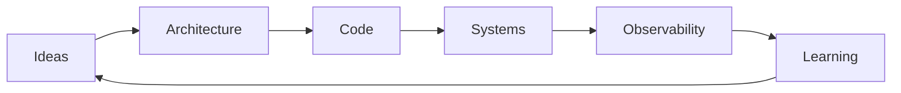

<div align="center">

# 🧭 Cesar Schutz
### Architecture Blueprint

</div>



## Áreas centrais

```text
┌──────────────────────┐
│ SOFTWARE ARCHITECTURE│
└──────────┬───────────┘
           │
   ┌───────┼────────┐
   ▼       ▼        ▼
 Domain  Events    APIs
   │       │        │
   └───────┼────────┘
           ▼
   Distributed Systems
           │
           ▼
     Observability
```

## Projetos

- `blog` — conhecimento técnico documentado
- `noticias-dev-arq` — curadoria e descoberta
- `knowledge-base` — referência estruturada
- `swagger-agent` / `swagger-agent-adk` — agentes aplicados a APIs
- `jaeger-*` — observabilidade distribuída


---

### Recursos invisíveis deste modelo

- Mermaid nativo do GitHub para diagramas
- Diagramas ASCII para aparência de blueprint
- Pode alternar uma imagem blueprint clara/escura com `<picture>`
- Pode ter fluxo animado em um SVG próprio na versão final

> Protótipo visual. Na versão final, posso substituir serviços externos por SVGs próprios e Actions no seu repositório.
