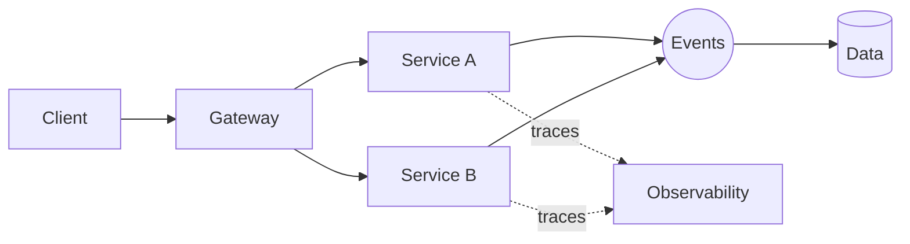

# Cesar Schutz
### Designing systems that remain understandable as they grow

## Current landscape

| Layer | Technologies / interests |
|---|---|
| Domain | DDD, modularity, boundaries |
| Integration | APIs, events, messaging |
| Runtime | Java, Spring, containers |
| Platform | Cloud, Kubernetes, observability |
| Intelligence | Agents, MCP, ADK, LLM workflows |

## Selected experiments

`swagger-agent` · `swagger-agent-adk` · `first-mcp-weather` · `google-adk-cards` · `claude-code-kit`

---

### Recursos invisíveis deste modelo

- Typing SVG usado como “fluxo arquitetural animado”
- Mermaid renderizado pelo GitHub para arquitetura
- Na versão final eu faria um SVG próprio com pulsos percorrendo conexões
- Pode incluir animação CSS dentro do SVG, sem JavaScript no README

> Protótipo visual. Na versão final, posso substituir serviços externos por SVGs próprios e Actions no seu repositório.
